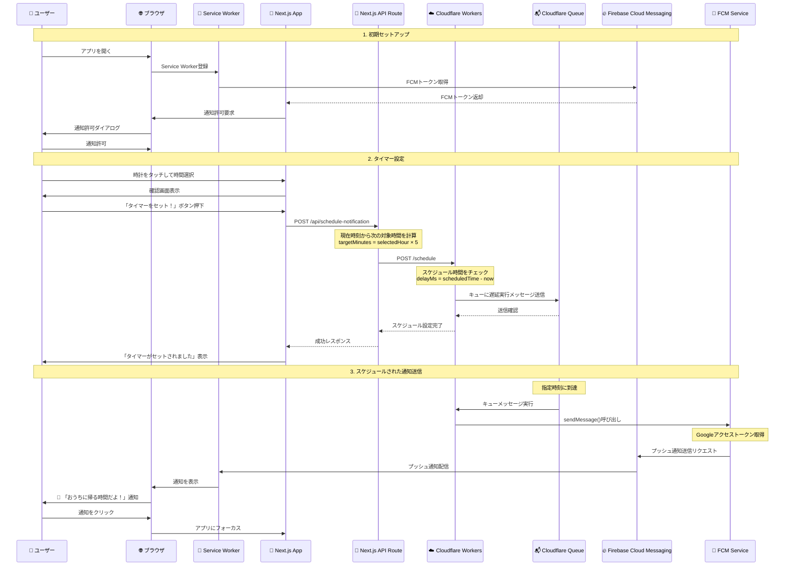

# プッシュ通知システムフロー図

## 📋 システム概要
ユーザーが指定した時間にプッシュ通知を送信する仕組み

## 🔄 システムフロー



## 🏗️ アーキテクチャ詳細

### 1. フロントエンド (Next.js + Vercel)
- **場所**: `src/app/page.tsx`
- **役割**: 
  - ユーザーインターフェース
  - FCMトークン取得
  - Service Worker登録
  - タイマー設定API呼び出し

### 2. API Route (Next.js)
- **場所**: `src/app/api/schedule-notification/route.ts`
- **役割**:
  - タイマー設定リクエスト受信
  - 次の通知時刻計算
  - Cloudflare Workersへの転送

### 3. Service Worker
- **場所**: `public/firebase-messaging-sw.js`
- **役割**:
  - プッシュ通知受信
  - 通知表示
  - 通知クリック処理

### 4. Cloudflare Workers
- **場所**: `cloudflare-workers/src/index.ts`
- **役割**:
  - スケジュールリクエスト処理
  - Cloudflare Queueへの遅延実行登録
  - FCMサービス呼び出し

### 5. FCM Service
- **場所**: `cloudflare-workers/src/fcm.ts`
- **役割**:
  - Google認証
  - Firebase Cloud Messaging API呼び出し

### 6. Cloudflare Queue
- **設定**: `cloudflare-workers/wrangler.toml`
- **役割**:
  - 遅延実行メッセージ管理
  - 指定時刻にワーカー実行

## 🔧 技術スタック

| コンポーネント | 技術 |
|---|---|
| フロントエンド | Next.js 15.3.2 |
| ホスティング | Vercel |
| Service Worker | Cloudflare Workers |
| プッシュ通知 | Firebase Cloud Messaging (FCM) |
| スケジューリング | Cloudflare Queue |
| 認証 | Google Auth Library |

## 📊 データフロー

### スケジュール設定時
```json
{
  "fcmToken": "FCMトークン",
  "scheduledTime": "2024-01-01T15:30:00.000Z",
  "targetHour": 6,
  "message": {
    "title": "🏠 おうちに帰る時間だよ！",
    "body": "長い針が6になったよ！お家に帰りましょう🎈",
    "icon": "/icon.png",
    "badge": "/badge.png"
  }
}
```

### 通知送信時
```json
{
  "message": {
    "token": "FCMトークン",
    "notification": {
      "title": "🏠 おうちに帰る時間だよ！",
      "body": "長い針が6になったよ！お家に帰りましょう🎈"
    },
    "data": {
      "type": "home_timer",
      "targetHour": "6"
    },
    "webpush": {
      "notification": {
        "icon": "/icon.png",
        "badge": "/badge.png"
      }
    }
  }
}
``` 